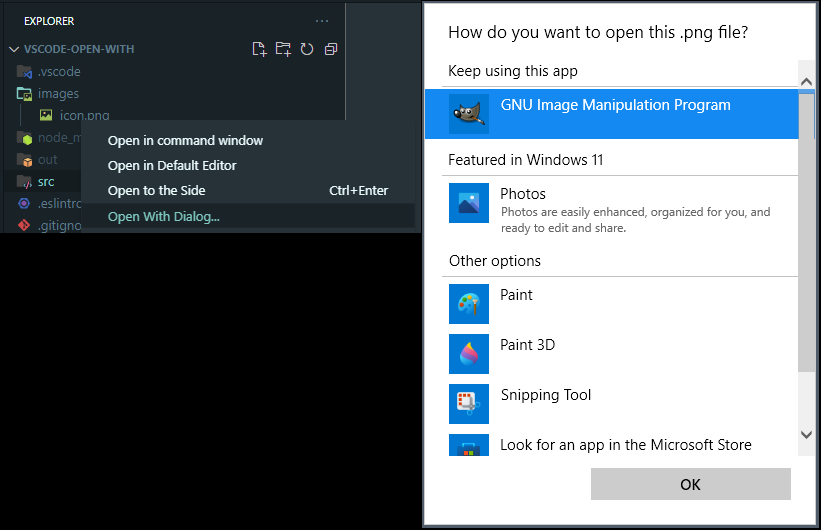

# vscode-open-with README (MS Windows only)

Show Widnows Open With dialog for selected file.

Addresses [Support opening files with an external application](https://github.com/microsoft/vscode/issues/140004)

## Features

## Requirements

Window OS

## Extension Settings

None.

## Known Issues

None.

## Release Notes

### 1.0.0

Initial release.